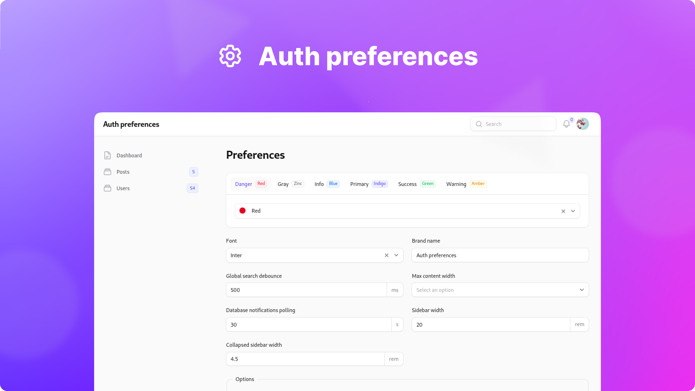

<p align="center">
    <a href="https://github.com/sakanjo/filament-auth-preferences/actions"></a>
    <a href="https://laravel.com"></a>
    <a href="https://php.net"></a>
</p>

<p align="center">A Filament plugin to manage user preferences.</p>

> ✨ Help support the maintenance of this package by [sponsoring me](https://github.com/sponsors/sakanjo).

Table of Contents
=================

* [Install](#-install)
* [Usage](#-usage)
* [Presets](#presets)
* [Functions](#functions)
  * [prefers](#prefers)
* [Support the development](#-support-the-development)
* [Credits](#%EF%B8%8F-credits)
* [License](#-license)

## 📦 Install

Install the package via composer:

```
composer require sakanjo/filament-auth-preferences
```

## 🦄 Usage

```php
<?php

// ...
use SaKanjo\FilamentAuthPreferences\AuthPreferencesPlugin;
use App\Filament\Presets\MyPreset;

public function panel(Panel $panel): Panel
{
    return $panel
        ->plugin(
            AuthPreferencesPlugin::make()
                ->preset(MyPreset::make())
        );
}
```

## Presets

The package comes with a default preset that you can use out of the box. You can also create your own custom preset by extending the `SaKanjo\FilamentAuthPreferences\Presets\Preset` class.

```php
<?php

namespace App\Filament\Presets;

use Filament\Facades\Filament;
use Filament\Forms;
use SaKanjo\FilamentAuthPreferences\Presets\Preset;

class MyPreset extends Preset
{
    public static function data(): array
    {
        $panel = Filament::getCurrentPanel();

        return [
            'brandName' => $panel->getBrandName(),
            'topNavigation' => $panel->hasTopNavigation(),
        ];
    }

    public static function schema(): array
    {
        return [
            Forms\Components\TextInput::make('brandName'),

            Forms\Components\Toggle::make('topNavigation'),
        ];
    }

    public static function apply(array $data): void
    {
        $panel = Filament::getCurrentPanel();

        foreach ($data as $method => $value) {
            match ($method) {
                'brandName' => $panel->brandName($value),
                'topNavigation' => $panel->topNavigation($value),
                default => null
            };
        }
    }
}
```

## Functions

### prefers

```php

namespace App\Filament\Admin\Resources;

use function SaKanjo\FilamentAuthPreferences\prefers;

class UserResource extends Resource {
    // ...

    public static function table(Table $table): Table
    {
        return $table
            ->columns([
                Tables\Columns\TextColumn::make('created_at')
                    ->visible(prefers('to_show_timestamps', true))
                    ->dateTime(),

                Tables\Columns\TextColumn::make('updated_at')
                    ->visible(prefers('to_show_timestamps', true))
                    ->dateTime(),
            ]);
    }
}

```

## 💖 Support the development

**Do you like this project? Support it by donating**

Click the ["💖 Sponsor"](https://github.com/sponsors/sakanjo) at the top of this repo.

## ©️ Credits

- [Salah Kanjo](https://github.com/sakanjo)
- [All Contributors](../../contributors)

## 📄 License

[MIT License](https://github.com/sakanjo/filament-auth-preferences/blob/master/LICENSE) © 2023-PRESENT [Salah Kanjo](https://github.com/sakanjo)
